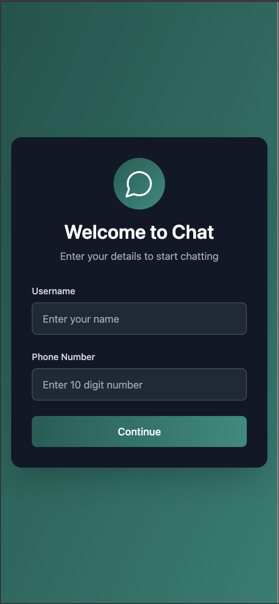
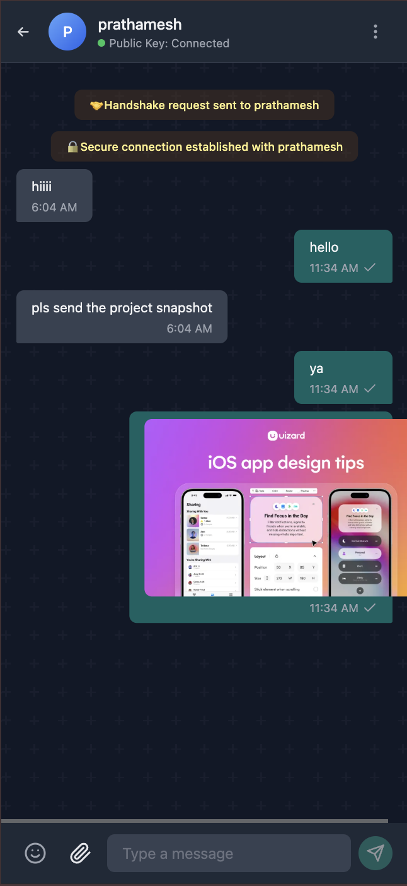
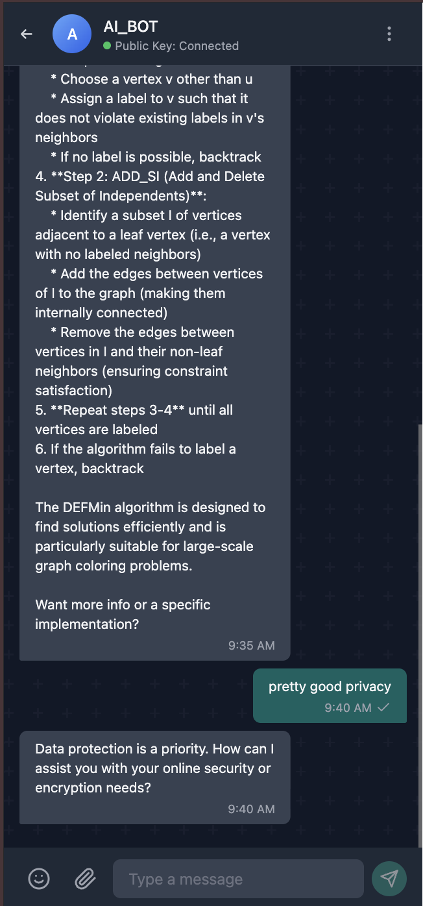

# 🔐 End-to-End Encrypted Chat Application

A real-time chat application with **end-to-end encryption**, built using **Python (FastAPI + WebSockets)** on the backend and **React** on the frontend.  
Messages are encrypted on the client side using **AES (CryptoJS)**, ensuring that even the server cannot read user conversations.

---

## 🚀 Features

✅ Real-time messaging using WebSockets  
✅ End-to-End Encryption (AES-256 client-side encryption)  
✅ No message stored in plain text  
✅ Multi-user support  
✅ Typing indicator & online status  
✅ Auto-reconnect WebSocket client  
✅ Lightweight & scalable backend (FastAPI)  
✅ Secure authentication (JWT)  
✅ Works in browser & local network  

---

## 🏗️ Tech Stack

| Layer | Tech Used |
|-------|-----------|
| Frontend | React + Vite + TailwindCSS |
| Backend | FastAPI + WebSockets |
| Encryption | CryptoJS (AES) |
| Database (optional) | MongoDB / PostgreSQL |
| Deployment | Docker + Nginx (coming soon) |

---

## 📌 Architecture Overview

Client (React + CryptoJS AES)
|
|  🔐 (Encrypted WebSocket Message)
v
FastAPI WebSocket Gateway
|
v
Broadcast to Other Clients (Encrypted Data Only)
> 🔍 Server **never sees decrypted messages**. Decryption happens only in the browser.

---

## 🖼️ Screenshots

### 🔑 Login / Username Screen  


### 💬 Chat Window  


### 🔐 Encrypted Payload Example  


📌 _Place your images inside a folder called `screenshots/` in your repo._

---

## ⚙️ Setup Instructions

### 1️⃣ Clone the repository

```sh
git clone [https://github.com/yourusername/encrypted-chat-app.git](https://github.com/Pathuz21/Chat_App)
cd encrypted-chat-app

